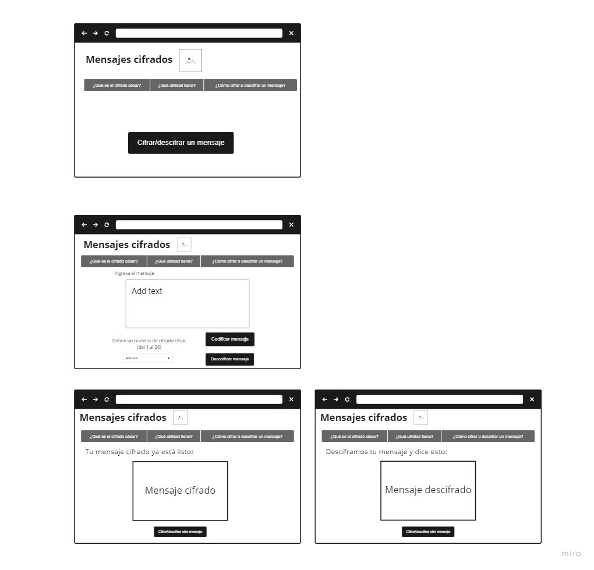

# Cifrado César

## Índice

* [1. MENSAJES CIFRADOS](#1-mensajes-cifrados)
* [2. CABECERA](#2-cabecera)
* [3. PANTALLA PRINCIPAL](#3-pantalla-principal)
* [4. PANTALLA INPUT](#4-pantalla-input)
* [5. PANTALLAS OUTPUT](#5-pantalla-output)
* [6. SECCIONES INFORMATIVAS](#6-secciones-informativas)
* [7. CONTENIDO DE LAS SECCIONES INFORMATIVAS DE LA APLICACIÓN.](#7-contenido-secciones-informativas-de-la-aplicacion)

***

## 1. Mensajes cifrados

_Mensajes cifrados_ es una aplicación que permite cifrar y descifrar mensajes al estilo “cifrado césar”. Esto permite que pueda ser utilizada por una gran variedad de usuarios que buscan cifrar mensajes, ya sea para mantener la confidencialidad de información que les interese resguardar o simplemente para enviar mensajes muy originales. 
Por ello se decidió crear una aplicación con una interfaz sencilla y muy informativa. 
Este es el prototipo inicial del diseño de la aplicación:

## 2. CABECERA

En la _cabecera_ de todas las pantallas que conforman la aplicación, se encuentra el encabezado con el nombre del producto y una barra de navegación que permiten al usuario acceder a las secciones informativas de la app:

* ¿Qué es el cifrado césar?
* ¿Qué utilidad tiene?
* ¿Cómo puedo cifrar o descifrar un mensaje?

## 3. PANTALLA PRINCIPAL

La _Pantalla principal_ da la bienvenida al usuario y explica brevemente en qué consiste la aplicación.
 En la parte inferior de esta pantalla se encuentra un botón con la leyenda “cifrar o descifrar un mensaje”, el cual permitirá que el usuario pueda acceder directamente a la pantalla que le permitirá utilizar la aplicación (Acceder a la Pantalla input).

## 4. PANTALLA INPUT

La _Pantalla input_ es la pantalla donde se podrá ingresar el mensaje que se desee cifrar o descifrar. En ella se encuentra un cuadro de texto, donde el usuario podrá ingresar el mensaje que cifrará o descifrará con el uso de esta aplicación. Este mensaje será máximo de 1000 caracteres. En el encabezado del recuadro de texto se indica el número de caracteres máximos permitidos y notas adicionales donde se indica que la letra ñ, letras con acentos o con cualquier otro signo no sufren ningún tipo de transformación. 
Debajo del recuadro de texto, se encuentra un cuadro numérico donde el usuario podrá seleccionar el numero offset en el que su mensaje será cifrado. Este cuadro tendrá la leyenda “Número de Cifrado César” para que sea más entendible para el usuario. El valor offset default será el numero “0” , lo cual enviará un mensaje sin transformación.

Al final de la pantalla input se encuentran dos botones: 

### Botón “cifrar mensaje”: 
Cifrará el mensaje ingresado con el offset seleccionado y dirigirá al usuario a una pantalla Output donde se mostrará el mensaje cifrado. Arriba del mensaje se mostrará la leyenda “Tu mensaje cifrado está listo:” para mejorar la experiencia del usuario. Seguido del mensaje se indica el número offset en el que se realizó el cifrado para que sea sencillo para en usuario recordarlo y copiarlo junto con el mensaje para enviarlo sin la necesidad de escribirlo por él mismo.

### Botón “Descifrar mensaje”: 
Descifrará el mensaje ingresado con el offset seleccionado y dirigirá al usuario a una pantalla Output donde se mostrará el mensaje descifrado. Arriba del mensaje se mostrará la leyenda “Hemos descifrado tu mensaje y dice esto:” para mejorar la experiencia del usuario. Seguido del mensaje se indica el número offset que el usuario ingresó para descifrar el mensaje en cuestión, lo cual le permitirá verificar que ingresó el offset correcto y tener certeza de que su mensaje se descifró correctamente.

## 5. PANTALLAS OUTPUT

Las _Pantallas Output_ son las pantallas en las que se mostrará el mensaje cifrado o descifrado que ingrese el usuario. 
Para que la experiencia del usuario sea más personalizada existen dos tipos de pantalla output:

### Pantalla output para mensajes cifrados: 

En esta pantalla se mostrará el mensaje cifrado. Arriba del mensaje se mostrará la leyenda “Tu mensaje cifrado está listo:” para mejorar la experiencia del usuario. Seguido del mensaje se indica el número offset en el que se realizó el cifrado para que sea sencillo para en usuario recordarlo y copiarlo junto con el mensaje para enviarlo sin la necesidad de escribirlo por él mismo.

### Pantalla output para mensajes descifrados: 

En esta pantalla se mostrará el mensaje descifrado. Arriba del mensaje se mostrará la leyenda “Hemos descifrado tu mensaje y dice esto:” para mejorar la experiencia del usuario. Seguido del mensaje se indica el número offset que el usuario ingresó para descifrar el mensaje en cuestión, lo cual le permitirá verificar que ingresó el offset correcto y tener certeza de que su mensaje se descifró correctamente.

En la parte inferior de las pantallas output se encuentran dos botones, que facilitarán al usuario navegar por la aplicación:

### Botón “Cifrar o descifrar un mensaje nuevo”: 

Este botón llevará al usuario a la pantalla input para que pueda ingresar otro mensaje y cifrarlo o descifrarlo. Este botón también limpiará el cuadro de texto y devolverá el recuadro offset a “0” para que el usuario pueda ingresar un mensaje nuevo sin la necesidad de borrar lo que ingresó anteriormente. 

### Botón “Volver al inicio”: 

Este botón permitirá que el usuario regrese a la pantalla de inicio. Este botón también reestablecerá los valores originales de los recuadros de la “Pantalla input”.

## 6. SECCIONES INFORMATIVAS

Las “Secciones informativas” son pantallas que contienen información que se considera muy relevante acerca de la aplicación, explicando en qué consiste, el alcance que podría tener en cuanto a usos y por supuesto, una breve guía de usuario. 
Se incorporaron estas pantallas con el fin de informar al usuario pero también con el fin de invitarlo a utilizar la aplicación.
 Se puede acceder a cada una de estas secciones por medio de los enlaces que direccionan al usuario a las pantallas que contienen esta información. Existen 3 pantallas de secciones informativas:

### Pantalla ¿Qué es el cifrado César?
En esta pantalla de explica brevemente en qué consiste el cifrado césar. Dentro de la pantalla de incluye una imagen que ejemplifica el Cifrado César.

### Pantalla ¿Qué utilidad tiene?
Con el fin de mostrar la gran versatilidad que puede tener el uso de Mensajes cifrados, en esta pantalla se ejemplifican algunos de estos usos, dando la posibilidad de que el usuario imagine otras situaciones en las que cifrar un mensaje podría resultar útil para su vida cotidiana y se le explica lo sencillo que es cifrar sus mensajes por medio de esta aplicación.
 
### Pantalla ¿Cómo cifrar o descifrar un mensaje?  
En esta pantalla informativa, podemos encontrar una guía rápida del uso de esta aplicación. En esta Guía de usuario se explica cómo acceder la “Pantalla Input” desde la pantalla de Inicio. Posteriormente se muestra una imagen de la pantalla input para que el usuario pueda identificarla. Después se explican los pasos a seguir para ingresar un mensaje y para definir un offset (Número de Cifrado César), incluyendo la nota en la que se explica que la letra ñ y letras con otro tipo de carácter, no sufren ninguna transformación. Por último, se explica claramente qué botón presionar dependiendo si el usuario desea cifrar o descifrar su mensaje. 
Como ya se mencionó, al final de cada una de estas secciones informativas, se invita al usuario a probar la aplicación y es por ello que en estas pantallas se incluyó un botón “Cifrar o descifrar un mensaje”, el cual dirigirá al usuario a la “Pantalla input” para empezar a descifrar un mensaje.

NOTA: Este botón no hace “reset” de la “Pantalla input”, es decir, no reestablece los valores originales del cuadro de texto ni del cuadro offset, esto pensando en que el usuario pueda consultar las secciones informativas para aclarar dudas que pudieran surgir al momento de introducir su mensaje en pantalla input sin que se borre el mensaje que esté ingresando.

Dentro de estas pantallas también se incluyó un botón “Volver al inicio” para facilitar la navegación del usuario por las diferentes secciones de la aplicación.

***

## 7. CONTENIDO DE LAS SECCIONES INFORMATIVAS DE LA APLICACIÓN.

### ¿Qué es el Cifrado César?
En criptografía, el cifrado César, también conocido como cifrado por desplazamiento, código de César o desplazamiento de César, es una de las técnicas de cifrado más simples y más usadas. Es un tipo de cifrado por sustitución en el que una letra en el texto original es reemplazada por otra letra que se encuentra un número fijo de posiciones más adelante en el alfabeto. Por ejemplo, con un desplazamiento de 3, la A sería sustituida por la D (situada 3 lugares a la derecha de la A), la B sería reemplazada por la E, etc. Este método debe su nombre a Julio César, que lo usaba para comunicarse con sus generales.

Esta manera de cifrar resulta ser muy útil para mantener en secreto algunos mensajes, sin embargo, también suena algo muy laborioso, pero con Mensajes Cifrados esto es muy sencillo.
Esta aplicación te permite cifrar y descifrar mensajes al estilo Cifrado César de una manera rápida y sencilla.  Únicamente tienes que ingresar tu mensaje y seleccionar el número de Cifrado César o de desplazamientos en el que quieras cifrar o descifrar tu mensaje.
¡Prueba con tu primer mensaje!

### ¿Qué utilidad tiene?
Piénsalo. El Cifrado Cesar te permite escribir mensajes secretos en los que tú puedes elegir un número de desplazamientos de letras para cifrarlo. Podría resultar muy útil para proteger información sensible que quieras compartir con alguien más. Existe una amplia gama de aplicaciones para ese tipo de mensajes, desde cifrar mensajes en medio de una zona de conflictos, conservar en secreto la receta de la familia, mantener la exclusividad de un evento, proteger identidad del ganador en algún certamen para que no se sepa antes de tiempo o incluso para sorprender a alguien con una carta de amor muy original.

Con Mensajes cifrados puedes cifrar un mensaje definiendo el número de desplazamientos para que quien reciba el mensaje pueda descifrarlo al alcance de un “Click”.

### ¿Cómo cifrar o descifrar un mensaje?
Mensajes cifrados te permitirá cifrar mensajes al estilo “Cifrado César” de una manera muy sencilla.

Primero, debes presionar el botón “cifrar o descifrar un mensaje”. Este botón te llevará a la página dónde podrás ingresar tu mensaje, la cual lucirá así:

Cuando estés en esa página, escribe tu mensaje en el cuadro de texto y selecciona el número de desplazamientos para cifrar o descifrar tu mensaje. (Máximo 1000 caracteres, sin acentos).
NOTA: El cifrado césar solo cifra letras del alfabeto, no números ni otro tipo de signos, pero sí se pueden incluir en el mensaje, sólo que se conservarán tal y como están. Por el momento la letra “ñ” ni las letras con acentos o algún otro tipo de signo sufren alguna transformación. 

Por último, da click en el botón “Cifrar mensaje” si quieres que tu mensaje sea cifrado o da click en el botón “Descifrar un mensaje” para descifrarlo.
¡Y listo! Obtendrás tu mensaje cifrado o descifrado.  Verás qué sencillo es.

Podrás volver a cifrar o descifrar mensajes las veces que quieras presionando el botón “Cifrar o descifrar un mensaje nuevo”.
